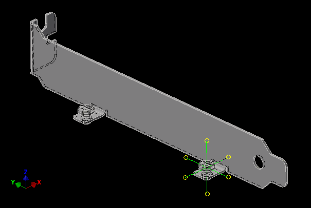
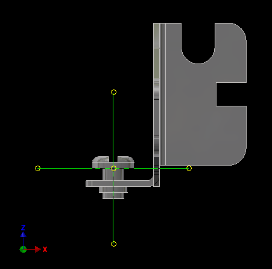

# Keystone_9202
My attempt at a 3D model of the Keystone 9202 PC mounting bracket. Used with the corresponding Kicad footprint. 

## Revision 0:
- First release of the model.
- Origin of the model is centered underneath the screw head closest towards the bottom of the bracket.
- This model assumes a circuit board thickness of 1.6mm
- If mating this 3D model to the corresponding Kicad footprint: use X offset 20.3962mm, Y offset 11.8820mm and Z offset 0mm. This is because the Kicad footprint origin is centred on the ISA 8bit card edge connector Pad A01/B01. 

