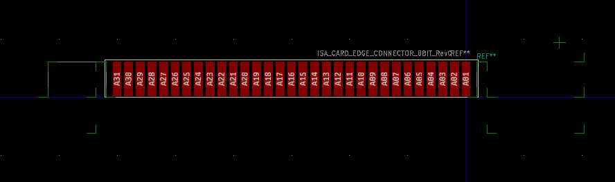

# ISA_Card_Edge_Connector_8bit
A Kicad footprint describing the 8-bit ISA card edge connector.

## Revision 0:
- First release of the footprint.
- Footprint origin is aligned to the bottom centre of Pad A01 (Pad B01) of the corresponding 8bit ISA card edge connector.
- Board edge guides are on the "Eco1.User" layer. Take care as they are strange decimal fractions.
- Board edge guide duplicated on the "F.Fab" layer adjacent to the card edge connector (can't remember why I did this...)
- See corresponding ISA card edge reference drawing for exact board edge locations.
- Corresponding Keystone 9202 hole location reference shown as a cross in the upper right hand of the symbol on the "Eco1.User" layer.

