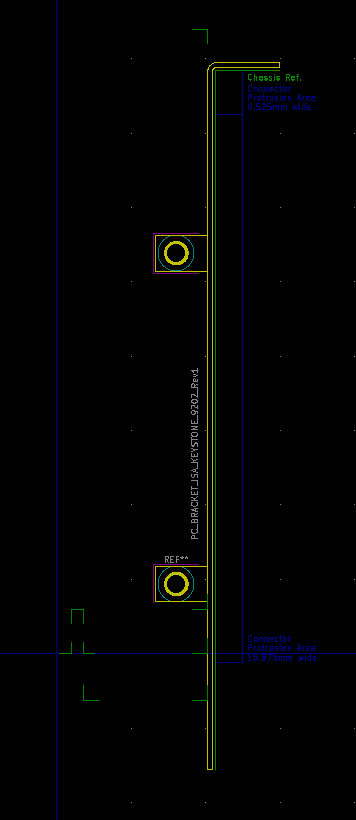
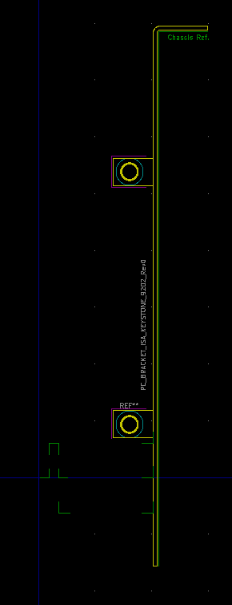

# PC_Bracket_ISA_Keystone_9202
A Kicad footprint describing the Keystone 9202 mounting bracket, referenced to the bottom of pad A1 of the 8-bit ISA card edge connector.

## Revision 1:
- Added a reference for the location of protruding connectors to the "Cmts.User" layer.
- Added maximum permissible upper board edge reference to the "Eco1.User" layer.

## Revision 0:
- First release of the footprint.
- Footprint origin is aligned to the bottom centre of Pad A01 (Pad B01) of the corresponding 8bit ISA card edge connector.
- Board edge guides are on the "Eco1.User" layer. Take care as they are strange decimal fractions.
- See corresponding ISA card edge reference drawing for exact board edge locations.
- Bracket physical outline is on the "Eco2.User" layer.
- Board mounting holes presented as circular plated through holes, 3.2mm dia. "Pin 1" located towards bottom of bracket. "Pin 2" located towards top of bracket. 

